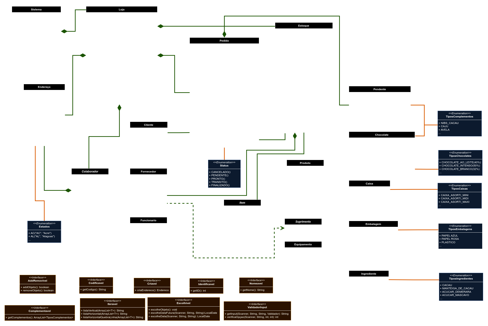

***
# **ChocoStock - O doce controle de vendas e estoque**
## Descrição
- Este é um projeto de um sistema de controle de estoque e vendas para uma fábrica de chocolate, desenvolvido em Java como parte de um Projeto Prático da matéria **MC302 - Programação Orientada a Objetos do Instituto de Computação da UNICAMP** no ano de 2024. O sistema permite gerenciar o estoque de produtos da fábrica, realizar vendas e controlar o fluxo de entrada e saída de produtos.

## Desenvolvedores
- [Ainaras Marão](https://github.com/MaraoLT) - 182338
- [Douglas Pereira](https://github.com/Dourialp) - 245202
- [Matheus Veiga](https://github.com/mvl18) - 269494
- [Yan Oliveira](https://github.com/Cl4nyz) - 236363

## Motivação
- A motivação por trás deste projeto é criar uma ferramenta eficiente para auxiliar na gestão do estoque e das vendas de uma fábrica de chocolate. Automatizar esses processos pode aumentar a eficiência operacional e reduzir erros humanos.

## Aplicação Cotidiana
Este sistema pode ser utilizado no cotidiano da fábrica de chocolate para realizar as seguintes tarefas:
- Registro dos clientes da loja da fábrica.
- Registro de matéria prima no estoque, assim como os dados do fornecedor daquele suprimento.
- Registro de todos os produtos finalizados e que agora fazem parte do estoque de vendas.
- Registro de novos pedidos de clientes, assim como todo o controle para saber se o pedido já foi pago ou enviado ao cliente.
- Verificar a disponibilidade de produtos no estoque.
- Atualizar a quantidade de produtos e de matéria prima disponíveis no estoque, a fim de facilitar o controle.
- Histórico de todos os pedidos, bem como a capacidade de gerar relatórios de venda e estoque.

## [Diagrama UML do Projeto](https://app.diagrams.net/#G1ob392-avmraMdT-HdXfV2x8NyNQ4EVuE#%7B%22pageId%22%3A%22X-9vTq_ojHjCq0rzShb6%22%7D)

### Classes
- `Sistema`: A classe Sistema é responsável por: 
	- Inicializar o sistema e exibir a mensagem de boas-vindas.
	- Gerenciar e navegar entre os diferentes menus do sistema: menu inicial, menu de pedidos, menu de estoque e menu de colaboradores.
	- Delegar tarefas específicas aos métodos correspondentes em resposta às opções selecionadas pelo usuário em cada menu. 
	- Fornecer métodos de interação com a loja (instância da classe Loja) para adicionar pedidos, clientes, fornecedores e ingredientes, e para listar os pedidos, clientes e fornecedores existentes. 
- `Loja`: A classe Loja representa uma loja que gerencia clientes, funcionários, fornecedores, pedidos e estoque de produtos.
- `Pedido`: A classe Pedido representa uma ordem de compra realizada por um loja para um cliente. Cada pedido contém informações sobre o cliente, datas relevantes, status de pagamento, produtos incluídos no pedido, produtos pendentes e o preço total.
- `Estoque`: A classe Estoque gerencia os produtos, materiais, equipamentos e embalagens disponíveis no estoque da loja.
- `Endereço`: A classe Endereco representa um endereço físico, incluindo informações detalhadas como número, CEP, rua, bairro, cidade e estado.
- `Processa`: A classe Processa fornece métodos utilitários para normalizar strings e números.
- `Verifica`: A classe Verifica fornece métodos estáticos para validar diferentes tipos de entradas de dados comuns, como números de telefone, endereços de email, CEPs, CNPJs, URLs de sites, números, nomes e datas.
- `Colaborador`: A classe abstrata Colaborador serve como classe base para representar um colaborador (cliente, fornecedor e funcionário) com informações básicas como nome, telefone, email e endereço.
- `Cliente`: A classe Cliente representa um cliente que herda de Colaborador. Esta classe gerencia informações específicas do cliente, como um identificador único e uma lista de pedidos.
- `Fornecedor`: A classe Fornecedor representa um fornecedor que herda de Colaborador. Esta classe gerencia informações específicas do fornecedor, como um identificador único, CNPJ e site.
- `Funcionario`: A classe Funcionario representa um funcionário que herda de Colaborador. Esta classe gerencia informações específicas do funcionário, como um identificador único, cargo e salário.
- `Item`: A classe abstrata Item representa um item genérico que pode ser tanto um Produto quanto um Suprimento. Esta classe serve como base para itens específicos, fornecendo funcionalidades comuns como identificação, nome, quantidade e preço.
- `Suprimento`: A classe abstrata Suprimento representa um tipo de item fornecido por um fornecedor específico. Podendo esse item ser um ingrediente, uma embalagem ou um equipamento.
- `Equipamento`: A classe Equipamento representa um tipo específico de suprimento que é utilizado como equipamento para a fábrica de chocolates.
- `Ingrediente`: A classe Ingrediente representa um tipo específico de suprimento que é utilizado na produção de produtos. No caso, os chocolates.
- `Embalagem`: A classe Embalagem é uma subclasse de Suprimento que representa um tipo específico de suprimento usado para embalar produtos e formar as caixas.
- `Produto`: A classe Produto é uma subclasse de Item que representa um produto vendido pela loja.
- `Caixa`: A classe Caixa representa um tipo específico de produto com base na classe Produto. Possuindo seu tipo e seu lote.
- `Chocolate`: A classe Chocolate representa um tipo específico de produto com base na classe Produto. Possuindo seu tipo, seu lote, complementos do chocolate e a origem do cacau.
- `Pendente`: A classe Pendente representa um produto pendente a ser adicionado a um pedido na loja.

### Enums
- `Estados`: Lista as unidades federativas possíveis para os endereços.
- `Status`: Seta o status do pedido.
- `TiposEmbalagens`: Enumera os tipos de embalagem que a fábrica precisa comprar.
- `TiposIngredientes`: Enumera os tipos de ingredientes que a fábrica precisa comprar.
- `TiposChocolates`: Enumera todos os tipos de chocolate que a fábrica produz.
- `TiposComplementos`: Enumera todos os complementos para os chocolates.
- `TiposCaixas`: Enumera todos os tipos de caixa que a fábrica vende.

### Interfaces
- `AddRemovivel`: A interface AddRemovivel define métodos padrão para adicionar e remover objetos de uma lista.
- `Codificavel`: A interface Codificavel define o contrato para classes que possuem um método para obter um código.
- `Complementavel`: A interface Complementavel define o contrato para classes que possuem  um método para obter um complemento.
- `Criavel`: A interface Criavel define métodos para criar instâncias de objetos, utilizando a entrada do usuário para preencher os detalhes.
- `Escolhivel`: Essa interface cria um método pardrão com diversas sobrecargas com diferentes utilidades. Seu intuito é ser usada para facilitar pegar o input do usuário, sendo que ele deve escolher algo de uma lista de opções.
- `Identificavel`: A interface Identificavel define o contrato para classes que possuem um método para obter um ID.
- `Iteravel`: A interface Iteravel define métodos para criar representações de listas em formato de texto. (listaVertical, listaHorizontal e listaHorizontalQuebraLinha)
- `Nomeavel`: A interface Nomeavel define o contrato para classes que possuem um método para obter um nome.
- `ValidadorInput`: Interface que define um método padrão para obter entrada do usuário com validação. Também define uma interface interna para validadores de entrada.

## Heranças e Relações
O projeto utiliza herança e relações entre as classes para organizar e facilitar o desenvolvimento do sistema:

- No diagrama UML as heranças e relações são represntadas da seguinte forma:
	- **Herança:** linha branca com um triangulo vazio. 
	- **Associação:** linha verde simples.
	- **Agregação:** linha verde com um losango vazio no lado do "todo".
	- **Composição:** linha verde com um losango preenchido no lado do "todo".
	- **Dependência:** linha verde tracejada com uma seta.
	- **Interface:** linha laranja com uma circunferência.
	- **Enumeração:** linha laranja simples.

## Como Usar
Para utilizar este sistema, siga os passos abaixo:
1. Clone o repositório para a sua máquina local.
2. Abra o projeto em sua IDE favorita.
3. Compile e execute o arquivo principal `Main.java`.
4. Siga as instruções no console para interagir com o sistema.

## Contribuição
Contribuições são bem-vindas! Se você identificar algum problema ou tiver sugestões de melhorias, sinta-se à vontade para abrir uma issue ou enviar um pull request.

## Futuro do projeto
- [ ] Implementar interface gráfica.
- [ ] Implementar a classe Insumos, que abrangerá os gastos da fábrica com toda a matéria prima, pessoal, energia, água...
- [ ] Implementar a atualização de pedidos, para, por exemplo, ser possível cancelar um pedido.
